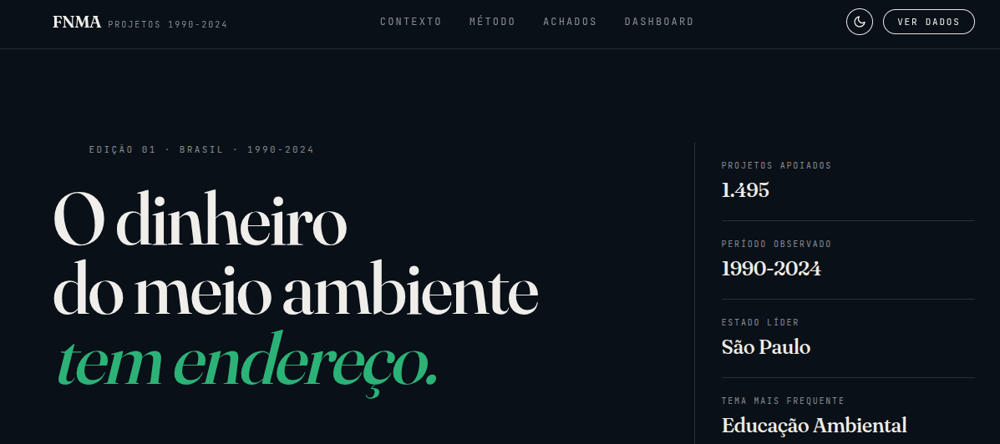
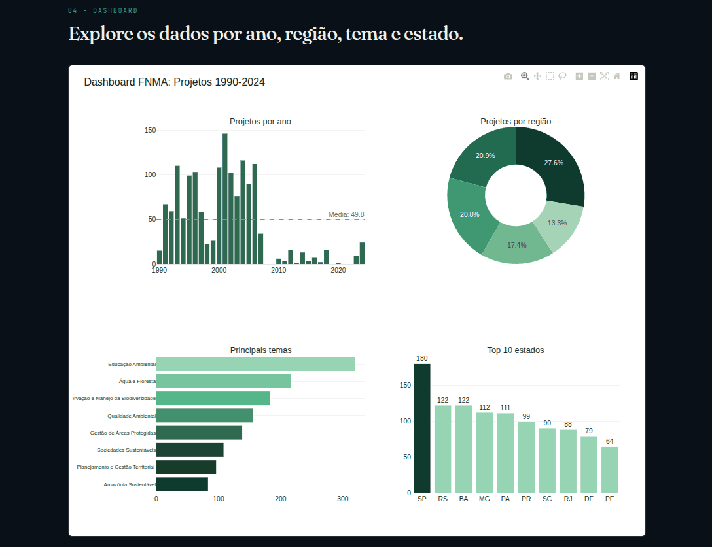
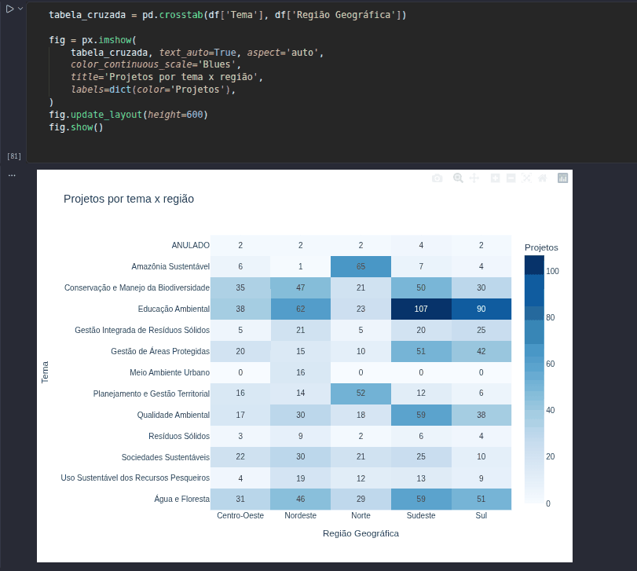

# Análise de Projetos do FNMA (1990–2024)


[](https://ericfariasds.github.io/projetos-fnma/)



## Site do projeto

[Clique aqui para visualizar](https://ericfariasds.github.io/projetos-fnma/)

Landing page editorial com contexto, metodologia, os principais achados da análise e o dashboard interativo embutido.

---

Projeto de análise e visualização de dados dos projetos financiados pelo **Fundo Nacional do Meio Ambiente (FNMA)** entre 1990 e 2024, desenvolvido como parte da minha jornada de aprendizado em Python e análise de dados.

---

## O que esse projeto faz

- Lê, limpa e trata os dados com pandas (inconsistências de texto, valores monetários em formato brasileiro, datas)
- Analisa os dados em Jupyter Notebook, com qualidade de dados documentada, cruzamentos e conclusões
- Gera gráficos estáticos com matplotlib
- Filtra os dados por região e período
- Cria um dashboard interativo com Plotly, publicado como site (GitHub Pages)
- Importa os dados para banco relacional (SQLite ou PostgreSQL) para consulta via SQL

---

## Tecnologias utilizadas

- Python 3.12
- pandas
- matplotlib
- seaborn
- Plotly
- Jupyter Notebook
- SQLite
- PostgreSQL + SQLAlchemy
- Git

---

## Estrutura do projeto

```
projetos-fnma/
├── assets/
│   └── readme/                   # imagens usadas neste README
├── data/
│   ├── fnma_1990_2024.csv
│   └── fnma.db                  # gerado localmente, não versionado
├── docs/                         # GitHub Pages - site público
│   ├── index.html                # Landing page (contexto, método, achados, dashboard)
│   ├── dashboard.html
│   ├── grafico_por_ano.html
│   ├── grafico_por_regiao.html
│   └── grafico_por_tema.html
├── notebooks/
│   └── analise_fnma.ipynb        # análise exploratória completa
├── outputs/
│   └── *.png                     # gráficos estáticos gerados por graficos.py / graficos_filtros.py
├── src/
│   ├── graficos.py               # gráficos estáticos com matplotlib
│   ├── graficos_filtros.py       # filtragem por região e período
│   ├── graficos_plotly.py        # dashboard interativo com Plotly (gera os HTMLs em docs/)
│   ├── importar.py               # importação do CSV para SQLite
│   └── importar_postgres.py      # importação do CSV para PostgreSQL
├── .gitignore
├── LICENSE
├── README.md
└── requirements.txt
```
> **Nota:** o arquivo `fnma.db` não está versionado. Ele é gerado localmente ao rodar `importar.py` (no passo 4 abaixo).

---

## Como rodar o projeto

**1. Clone o repositório:**

```bash
git clone https://github.com/ericfariasds/projetos-fnma.git
cd projetos-fnma
```

**2. Crie o ambiente virtual:**

```bash
python3 -m venv venv
source venv/bin/activate
```

**3. Instale as dependências:**

```bash
pip install -r requirements.txt
```

**4. Importe os dados para o banco de dados:**

Escolha uma das opções abaixo conforme o banco que deseja usar:

```bash
# Opção A - SQLite (sem instalação adicional)
python3 src/importar.py

# Opção B - PostgreSQL (requer servidor PostgreSQL rodando localmente)
# Edite a connection string em src/importar_postgres.py antes de rodar
python3 src/importar_postgres.py
```

**5. Gere os gráficos:**

```bash
# Gráficos estáticos com matplotlib (salvos em outputs/)
python3 src/graficos.py

# Filtros por região e período (salvos em outputs/)
python3 src/graficos_filtros.py

# Dashboard interativo (gera dashboard.html e os demais gráficos em docs/)
python3 src/graficos_plotly.py
```
> **Nota:** o `docs/index.html` (landing page) é editado manualmente e não é sobrescrito por esse script.

**6. Abra o Jupyter Notebook:**

```bash
jupyter notebook notebooks/analise_fnma.ipynb
```

---

## Banco de dados

O projeto suporta dois bancos relacionais para consulta dos dados via SQL:

| Script | Banco | Observação |
|---|---|---|
| `src/importar.py` | SQLite | Gera `data/fnma.db` localmente, sem configuração |
| `src/importar_postgres.py` | PostgreSQL | Requer servidor local; edite a connection string antes de rodar |

---

## Qualidade dos dados

Antes de qualquer análise, os dados brutos foram inspecionados e tratados no notebook:

- **Inconsistência de texto:** colunas categóricas (`Tema`, `Região Geográfica`, `Bioma`, etc.) tinham espaços extras criando categorias duplicadas - corrigido, reduzindo `Tema` de 16 para 13 categorias reais.
- **Valores monetários:** as colunas de valor vinham como texto no formato brasileiro (`41.212,07`) - convertidas para número.
- **Datas e duração:** convertidas para `datetime`; identificados **2 registros com duração de vigência negativa** (data de fim anterior à de assinatura), um erro de digitação na base original, documentado e excluído apenas da análise de duração.

---

## Prévia

**Dashboard interativo**, explorável por ano, região, tema e estado:



**Cruzamento tema x região**, um dos achados analíticos do notebook:



---

## Alguns insights dos dados

- **Educação Ambiental** é o tema mais financiado, com 319 projetos
- **Mata Atlântica** é o bioma que mais aparece nos projetos (757, contando cada bioma individualmente em projetos que tocam mais de um), mais que Amazônia e Cerrado somados
- O **Sudeste** lidera em número de projetos por região (27,6%), mas tem a **menor mediana de valor por projeto** entre as cinco regiões o **Nordeste**, com menos projetos, lidera em valor típico
- A distribuição de valor por projeto é assimétrica: mediana de **R$ 176 mil** contra uma média de **R$ 275 mil**, sinal de que poucos projetos de grande porte puxam a média para cima
- Houve um pico de atividade entre **1993 e 2006** (média de 87 projetos/ano), um hiato quase total entre 2007 e 2023, e uma retomada em **2024** (24 novos projetos)
- **São Paulo** é o estado com mais projetos (180)

A análise completa, com o raciocínio por trás de cada cruzamento, está no [notebook do projeto](notebooks/analise_fnma.ipynb).

---

## Aprendizados

Este projeto foi desenvolvido do zero como parte do meu aprendizado em:

- Leitura, limpeza e tratamento de dados com pandas (texto, valores monetários, datas)
- Criação de visualizações com matplotlib e Plotly, incluindo construção de uma identidade visual consistente entre gráficos
- Estruturação de uma análise exploratória em notebook, com documentação do raciocínio e das limitações dos dados
- Importação de dados para bancos relacionais (SQLite e PostgreSQL)
- Uso de ambiente virtual e gerenciamento de dependências
- Versionamento de código com Git e GitHub
- Publicação de sites com GitHub Pages, incluindo depuração de caminhos de arquivo e cache do navegador
- Análise exploratória de dados com Jupyter Notebook

---

## Fonte dos dados

[Dados Abertos - Ministério do Meio Ambiente](https://www.gov.br/mma/pt-br)

---

## Autor

**Eric Farias**
GitHub: [@ericfariasds](https://github.com/ericfariasds)